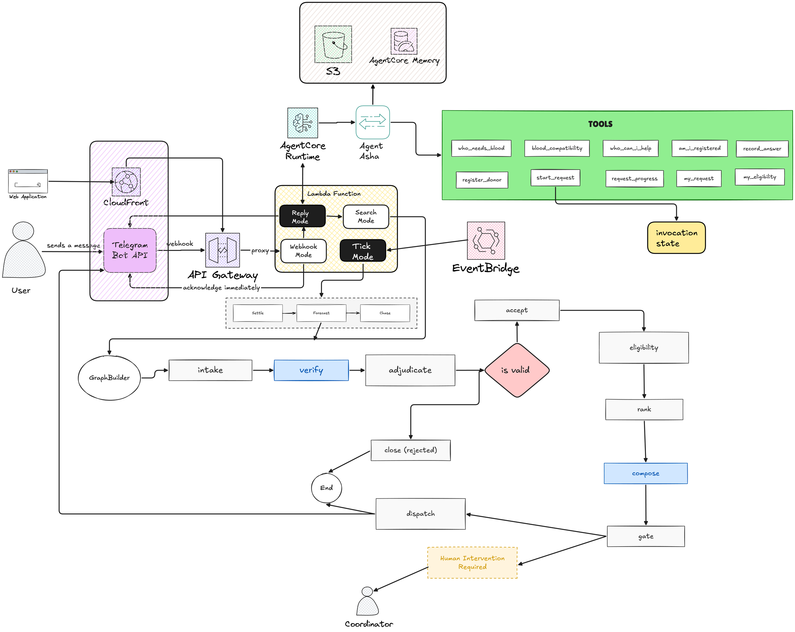

# DonorPanel

**Asha finds blood donors, so families don't have to.**

| | |
| --- | --- |
| Try it | [t.me/donorpanelbot](https://t.me/donorpanelbot) |
| Site | [d2ljcqat7a9ftn.cloudfront.net](https://d2ljcqat7a9ftn.cloudfront.net) |



Patients with thalassemia, sickle cell disease and rare phenotypes need matched blood on a recurring basis, often every three weeks, for life. The pool of donors who can match them is systematically smaller than the population that needs them, because matching follows ancestry and donor registries do not mirror their patients. Registries are large but mostly unreachable, so the recruiting burden falls on families, permanently.

DonorPanel holds the donor network so no family has to browse it, and does the asking so no family has to.

The product is a Telegram agent. There is no dashboard to learn and no account to create: you message Asha and she does the rest.

## The three conversations

Asha works out which one you are from what you say.

| You | She |
| --- | --- |
| "My friend needs a transfusion in a week" | Gathers name, city, blood group, units and date, opens a request, searches the network, reports back |
| "I'd like to help" | Registers you: name, city, blood group, consent. Geocodes your city so distance ranking works |
| (answering her outreach) | Records your pledge or decline, tells you the hospital and date |

## How a request actually moves

A Strands `Graph` of ten nodes. Only two are agents. **Everything that decides routing is deterministic code**, which is the point.

```
intake -> verify -> adjudicate -+-> accept -> eligibility -> rank -> compose -> gate -> dispatch
                                 \-> close
```

- `verify` (agent) reads the request and the patient's history, returns a typed `Verdict` via structured output. It can also raise `needs_review` with a reason when a human should look.
- `adjudicate` (code) turns that verdict into a branch and fails closed. Routing never depends on model prose.
- `eligibility`, `rank` (code) apply the policy YAML: compatibility table, haversine distance, donation recency, contact budget.
- `compose` (agent) writes one outreach draft per language and channel group.
- `gate` (code) decides whether the run is routine enough to send without waking anyone.
- `dispatch` (code) actually sends, and records delivery per donor.

Graph edge conditions read JSON blocks out of node output, never free text.

### The autonomy gate

The gate is what makes this an agent rather than a workflow. A routine scheduled transfusion goes out on its own. It stops and asks a human when the request is an emergency, when the verifier raised something, when the matched cohort is too small for the units needed, when a donor is over their monthly contact budget, or when no drafts were produced.

Escalation reasons are written for a coordinator, then translated into plain language before they reach whoever asked.

### Policies, not code

`policies/*.yaml` carry the condition rules: transfusion interval, units per session, donation recency, cohort multiple, required paperwork and the autonomy thresholds. `thalassemia-india` and `sickle-cell-uk` are the same product with different numbers, which is the point.

### Memory

AgentCore Memory, keyed on the person, with two strategies:

```
/donorpanel/{actorId}/shared/preferences/          userPreference
/donorpanel/{actorId}/agents/{agentid}/findings/   semantic
```

Writes take two paths on purpose, because they have very different latencies:

| Path | API | Readable after |
| --- | --- | --- |
| Facts we already know exactly (cohort size, channels, gate decision) | `BatchCreateMemoryRecords` | **~1.5s** |
| Patterns worth mining from conversation | `CreateEvent` then async extraction | **~70s** |

Writing a record we already hold, instead of paying a model to re-derive it from a transcript, is also what the AWS cost guidance recommends. On the next run `compose` reads that memory back with a single prefix query and folds it into its brief.

### Which model

One constructor in `agents/model.py` returns whichever provider `MODEL_PROVIDER` names, so all
three agents switch together and nothing else in the codebase knows which one is live.

**Bedrock is the intended provider** and the Bedrock path is complete. The deployment currently
runs on OpenRouter because the AWS account hit a Bedrock daily token cap that no model or region
escapes: Nova Pro, Lite and Micro, with and without the inference profile prefix, in
`ap-southeast-2`, `us-east-1` and `us-west-2`, all return the same `Too many tokens per day`.
Switching back is one line in `.env` and a redeploy.

The cap was partly self-inflicted, and the cause is worth stating because the fix is in this
repository. See [Answering without making Telegram wait](#answering-without-making-telegram-wait).

### The scheduled tick

Every six hours, three passes over the pool. All deterministic code, no agent involved.

**Close.** Requests past their date settle as `FULFILLED` or `SHORT`. This runs first for a reason: a patient with an open request is deliberately never re-forecast, so without closing, every patient becomes permanently invisible after their first request.

**Forecast.** A patient on a fixed cycle is predictable, so last transfusion plus the policy interval is the next one. Requests open before anyone asks.

**Chase.** `outreach.escalation_hours` declares `[0, 24, 48]`: contact at hour zero, widen the net after a day, once more after two, then stop. Stopping is the point. When the waves are exhausted and the request is still short, that is the signal a human is needed, not a reason to keep asking. Donors who declined are never asked again, and `max_contacts_per_donor_month` caps how often anyone hears from us.

The schedule runs more often than any wave so the policy holds the cadence rather than the timer. Every pass is idempotent, so a tick with nothing to do costs a second.

## What Strands actually does here

Worth spelling out, because "built with Strands" can mean one `Agent()` call or it can mean this.

### The graph, and why eight of ten nodes are not agents

`GraphBuilder` wires ten nodes. Only `verify` and `compose` call a model. The other eight are
plain Python subclassing `MultiAgentBase` through one shared adapter, `JsonNode` in
`graph/nodes/base.py`, which turns a dict-returning `run()` into the `NodeResult` shape a Graph
expects.

Two things that adapter gets right and are easy to get wrong:

- `run()` is synchronous and does blocking boto3 and model I/O, so it goes through
  `asyncio.to_thread`. Calling it directly freezes the event loop for the whole node.
- A node failure surfaces as a `FAILED` NodeResult the graph can route on, never as an exception.
  An exception kills the run and takes the ability to branch on failure with it.

Edge conditions read a JSON block out of the upstream node's output, never free text. `find_block`
scans for balanced blocks and takes the last one carrying the key, because a node's input carries
every upstream node's output concatenated and a naive first-brace-to-last-brace parse spans two
objects. `task_text` exists because a Graph hands a node a list of ContentBlock dicts rather than
a string, and `str()` on that escapes the newlines.

### Hooks, and picking the right event

`MemoryWriter` in `graph/hooks.py` is a `HookProvider` registered on `AfterNodeCallEvent`. It
writes a finished run to AgentCore Memory as the graph reaches a terminal node, so no node needs
to know memory exists.

Choosing that event was not obvious, and the two alternatives are both dead ends:

- `AfterInvocationEvent.result` is `None` when an agent uses structured output. Both of ours do,
  so a hook there would have read nothing.
- `AfterMultiAgentInvocationEvent` is constructed without `invocation_state`, so it cannot see the
  repository or the request id.

The callback is wrapped in `try`/`except` for a specific reason: the registry propagates callback
exceptions to the caller, and this event fires from inside a `finally` block. An unguarded hook
therefore kills the run **and** masks whatever actually failed. Memory is never worth that.

### Everything else in use

| Primitive | What it does here |
| --- | --- |
| `Agent` | Asha, the request verifier, the outreach composer |
| structured output | The verifier returns a typed `Verdict`, not prose to parse |
| `callback_handler=None` | Strands prints to stdout by default, and on Lambda stdout is CloudWatch |
| `@tool`, `ToolContext` | Ten conversational tools, plus `request_history` on the verifier |
| `invocation_state` | Carries the repository and request id through every node without globals |
| `S3SessionManager` | The conversation thread per person, so Asha resumes rather than restarts |
| `FileSessionManager` | The same thread on disk for local development |
| `ModelRetryStrategy` | Bounded retry on a throttled model. Defaults sleep 4, 8, 16, 32 then 64 seconds |
| `BedrockModel`, `OpenAIModel` | Two providers behind one constructor in `agents/model.py` |
| `EventLoopMetrics` | Per run telemetry on every node result |

`SESSION_EPOCH` in `entrypoints/runtime.py` is ours rather than the SDK's, and exists because
AgentCore keeps its own state per `runtimeSessionId` that clearing the session store does not
reach. Bumping it abandons a degraded session.

## Running it locally

You need Python 3.10+, Node 18+, and AWS credentials for `ap-southeast-2`.

```bash
uv venv && uv pip install -e ".[dev]"
cp .env.example .env          # then fill in the values below
cd web && npm install && npm run build && cd ..
uv run uvicorn donorpanel.entrypoints.devserver:app --port 8077
```

Open **http://127.0.0.1:8077** for the landing page. The dev server also runs the Telegram poller, so messaging your bot works while it is up.

Provision the AWS-side resources once:

```bash
uv run donorpanel init          # S3 bucket
uv run donorpanel memory-init   # AgentCore Memory, ~3 min, prints the id for .env
uv run donorpanel status        # confirms what is wired up
```

### `.env`

| Key | Needed for | Notes |
| --- | --- | --- |
| `AWS_REGION` | everything | `ap-southeast-2`. The account's SCP blocks S3 in `us-east-1`. |
| `MODEL_PROVIDER` | the agents | `bedrock` or `openrouter`. See [Which model](#which-model). |
| `BEDROCK_MODEL_ID` | the agents | `apac.amazon.nova-pro-v1:0`. |
| `OPENROUTER_API_KEY` | the fallback provider | Only read when `MODEL_PROVIDER=openrouter`. |
| `OPENROUTER_MODEL_ID` | the fallback provider | `anthropic/claude-sonnet-4-5`. |
| `DONORPANEL_BUCKET` | storage | Unset falls back to `data/local` on disk. |
| `AGENTCORE_MEMORY_ID` | memory | Unset disables memory cleanly; everything else still works. |
| `TELEGRAM_BOT_TOKEN` | the product | From `@BotFather`. |
| `TELEGRAM_BOT_USERNAME` | the landing page CTA | Without the `@`. |
| `TELEGRAM_DEMO_CHAT_ID` | the demo pool | Seeded donors route here, so outreach reaches the operator rather than strangers. |
| `TELEGRAM_ALLOWED_CHAT_IDS` | access control | **Pinned to one chat id means nobody else can reach the bot.** Clear it before sharing. |
| `TELEGRAM_WEBHOOK_SECRET` | deployment | Proves an inbound webhook came from Telegram. |
| `SES_SENDER_EMAIL`, `SES_DEMO_EMAIL` | email outreach | Both the same verified address: SES sandbox only sends to verified recipients. |

### Trying it

1. Message your bot. Ask for blood for someone, or offer to donate.
2. A request that clears the gate sends real Telegram messages, one per matched donor, each personalised by name and language.
3. Reply as a donor. Asha records the pledge and the request tracks toward fulfilment.
4. `uv run python -m donorpanel.services.forecast` shows what a scheduled tick would open today.

## Deployment

Live in `ap-southeast-2`:

```
Telegram ──webhook──► API Gateway ──► Lambda ──200 in 0.03s, then async to itself
                                                   │
                                                   ├──► AgentCore Runtime (Asha) ──► reply
                                                   └──► the request graph
EventBridge Scheduler ──6 hourly───► Lambda (close, forecast, chase)
CloudFront ──► S3 (landing page)
```

| Resource | Identifier |
| --- | --- |
| AgentCore Runtime | `DonorPanelAsha` |
| Lambda | `donorpanel`, arm64, 2 GB |
| HTTP API | `ypw5w9sz6g.execute-api.ap-southeast-2.amazonaws.com` |
| CloudFront | `d2ljcqat7a9ftn.cloudfront.net` |
| Schedule | `donorpanel-daily-forecast`, `rate(6 hours)` |

`deploy/` holds one rerunnable script per step: `roles`, `push`, `runtime`, `function`, `api`, `logs`, `schedule`, `site`. `deploy/deployed.json` records the image tag actually running, so the repository says what is deployed rather than only the console.

**Asha runs on AgentCore Runtime** because she is one agent, one request, one response, with a dedicated session per person. **The request graph runs in Lambda** because it is the opposite shape: ten nodes, thirty to seventy seconds, and nobody waiting. Using each service for what it is actually for.

The webhook replaces a polling loop. Polling needs one process running forever, which is the opposite of what serverless is for; `poll()` survives only for local development where there is no public endpoint to point Telegram at.

If AgentCore Runtime is unreachable, the Lambda answers in process with the identical code. A Runtime outage costs the architecture, not the demo.

### Answering without making Telegram wait

An API Gateway HTTP API caps an integration at **30 seconds**, and that is the hard maximum, not
a setting. A model call plus a session load runs past it, so the reply arrived as a 503. Telegram
reads a 503 as "send it again" and redelivers the same message every couple of minutes, for up to
a day. One greeting became thirteen Lambda invocations, each billed for a full 300 second timeout,
and 196 real invocations produced **3,737 throttle events**, which is what exhausted the Bedrock
daily cap in the first place.

Four things were wrong, and all four are fixed:

| Fault | Fix |
| --- | --- |
| The webhook answered synchronously | It acknowledges in **0.03s**, then invokes itself asynchronously and replies over the Telegram API |
| Strands retried a throttle 4, 8, 16, 32 then 64 seconds, above botocore's own retries | Both layers bounded, in `agents/model.py`. `max_attempts` is counted as retries *on top of* the first call, so 1 means two attempts |
| A failed model call produced silence | `apology()` distinguishes a throttle from a genuine fault, because "try again shortly" is a lie for one of them |
| AgentCore kept degraded state per `runtimeSessionId`, unreachable by clearing the session store | `SESSION_EPOCH` in `entrypoints/runtime.py`. Bumping it abandons bad sessions |

End to end, the reply went from never arriving to **3.8 seconds**. The remaining cost is roughly
3.5s of model call; `pool.ensure()` no longer re-reads S3 on warm containers and the memory write
happens after the answer is sent, since nothing in the reply depends on it.

## Security and privacy, stated honestly

- **Anyone can reach the bot.** `TELEGRAM_ALLOWED_CHAT_IDS` is empty so judges can use it, which means a stranger can register a donor and open a request that triggers real outreach. Outreach reaches nobody real: every seeded donor carries `TELEGRAM_DEMO_CHAT_ID`, so messages route to the operator's own phone.
- **Logs keep 30 days and mask personal data.** A CloudWatch Logs data protection policy masks Name, Address, EmailAddress, DateOfBirth and US phone numbers on both log groups. AWS has no managed identifier for Aadhaar or Indian phone numbers, which is a reason not to store them rather than to rely on masking.
- **Agent output never reaches logs.** `callback_handler=None` on every agent, because Strands prints reasoning to stdout by default and on Lambda stdout is CloudWatch. That would put donor names, dates of birth and blood groups into plaintext logs. A CloudWatch Logs data protection policy is the backstop.
- **The bot token never reaches logs either.** httpx logs full request URLs at INFO and a Telegram URL carries the token in its path, so httpx is pinned to WARNING.
- **Identity is federated from Telegram.** `from.id` identifies the speaker, `chat.id` is only where to reply. In a group those differ, and keying on the chat would give every member one shared identity and one shared memory.
- **There is no authorization model.** Anyone who can reach the bot can open a request and cause real outreach. The webhook secret proves Telegram sent the message; it proves nothing about the human behind it. AgentCore Policy with Cedar rules at a Gateway is the right answer and is not built.
- **Namespaces are organization, not access control.** The real boundary AWS documents is an IAM condition on `bedrock-agentcore:actorId` bound to a per-user principal. One process holding one credential cannot have that.
- **The OpenRouter key sits in plain environment variables** on the Lambda and the AgentCore
  Runtime, exactly as the Telegram bot token does. Secrets Manager with a runtime lookup is the
  right answer and is not built; this is a demo account and both credentials are revocable.
- Aadhaar numbers are never stored. Verification discards them.

## Not built yet

- **No proof of personhood.** A Telegram account is free. For a system that dispatches people to hospitals, that is the gap.
- **No cross-channel identity.** The same human on email and Telegram are two unrelated identities.
- **Email is outbound only.** Receiving mail through SES needs a verified domain with MX records, so there is no email equivalent of the Telegram conversation.
- **No evaluation harness.** Agent behaviour is covered by unit tests and stubs, not by scored evaluation runs.
- **Cognito is gone.** It existed for a coordinator console that no longer exists.

## Development

```bash
uv run pytest -q
uv run ruff check .
```

The suite avoids AWS: storage tests use moto or a temp directory, agents are stubbed, and channel tests fake the Telegram transport. Tests that call Bedrock are skipped unless `DONORPANEL_LIVE=1`.

## Layout

| Path | Purpose |
| --- | --- |
| `entrypoints/` | How the outside gets in: `cli`, `lambda_fn`, `runtime`, `poller`, `devserver` |
| `services/` | Application logic: `chat`, `outreach`, `forecast`, `chase`, `pool`, `seed` |
| `graph/` | The Strands graph: `flow`, `hooks`, and `nodes/` one class each |
| `agents/` | The three model-backed agents: `assistant`, `composer`, `verifier` |
| `tools/` | What Asha can actually do, bound per conversation |
| `domain/` | Models and the matching rules. Depends on nothing else |
| `adapters/` | How we reach the outside: `channels/`, `storage/`, `memory`, `geo` |
| `policies/` | Condition rules as YAML, not code |
| `web/` | The landing page: Vite, React, Tailwind v4 |

Everything under `src/donorpanel/` above. Outside it: `deploy/` holds one rerunnable script per
step, `tests/` the suite, and `archive/` the things that are finished rather than live, including
the pitch video pipeline, the builder.aws.com post, the architecture diagram and earlier design
notes that the code has since moved past.

Dependencies point inward. `entrypoints` and `adapters` know about `domain`; `domain` knows about neither.
